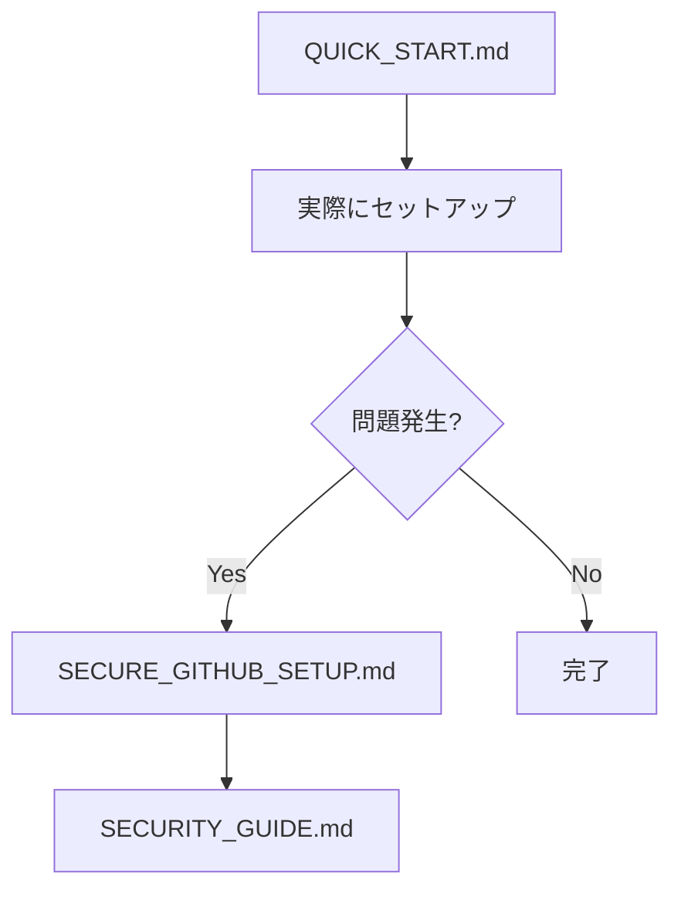
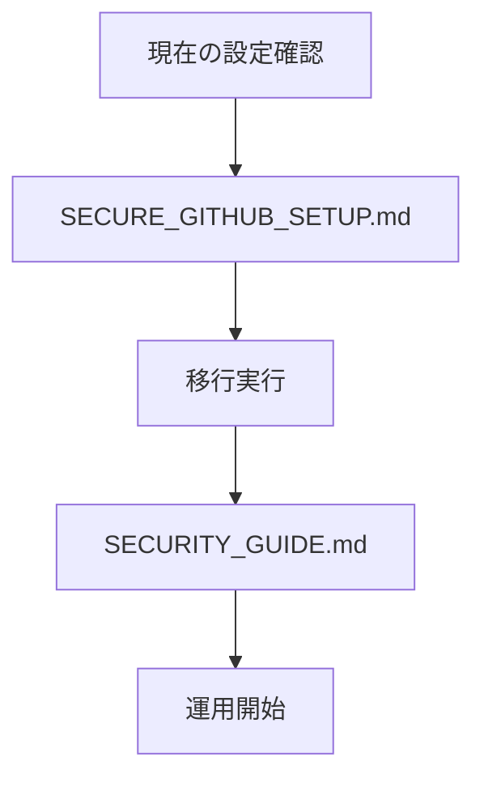

# Morinolab CMS Documentation

## 📖 概要

Morinolab CMSの設定と使用方法について説明したドキュメント集です。

## 🚀 クイックスタート

新規ユーザーは以下から始めてください：

1. **[QUICK_START.md](QUICK_START.md)** - 3分で完了するセットアップ（推奨）
2. **[SECURE_GITHUB_SETUP.md](SECURE_GITHUB_SETUP.md)** - セキュアなGitHub認証設定

## 📋 ドキュメント一覧

### 基本設定
- **[QUICK_START.md](QUICK_START.md)** - クイックスタートガイド（3分）
- **[ENVIRONMENT_SETUP.md](ENVIRONMENT_SETUP.md)** - 開発環境設定

### GitHub統合
- **[SECURE_GITHUB_SETUP.md](SECURE_GITHUB_SETUP.md)** - セキュアなGitHub認証設定
- **[GITHUB_INTEGRATION.md](GITHUB_INTEGRATION.md)** - GitHub統合機能
- **[OAUTH_SETUP_GUIDE.md](OAUTH_SETUP_GUIDE.md)** - ⚠️ 非推奨（従来版）

### セキュリティ
- **[SECURITY_GUIDE.md](SECURITY_GUIDE.md)** - セキュリティガイド

## ⚡ 最新の改善点

### setup-github の簡潔化

`setup-github` は直接指定による実行のみをサポートするように簡潔化されました：

```bash
# 新しい簡潔な方法
npm run setup-github YOUR_CLIENT_ID YOUR_CLIENT_SECRET
```

**削除された機能：**
- 環境変数による設定
- 対話的設定モード
- setup-github-help スクリプト

**理由：**
- 設定方法の統一
- ドキュメントの簡潔化
- ユーザー体験の向上

## 🔐 セキュリティ機能

### 暗号化システム
- **AES-256-GCM暗号化**: 認証情報の安全な保存
- **PBKDF2キー導出**: 100,000回の反復によるキー強化
- **改ざん検出**: 認証タグによる完全性確認

### 設定の優先順位
1. ユーザー設定（アプリ内）
2. ビルド時設定（暗号化済み）
3. 環境変数（フォールバック）

## 🛠️ 開発者向け

### ビルド手順

```bash
# セットアップ
npm run setup-github YOUR_CLIENT_ID YOUR_CLIENT_SECRET

# ビルド
npm run build

# 実行
npm run start
```

### パッケージング

```bash
npm run package  # プラットフォーム用パッケージ
npm run make     # 配布用バイナリ
```

## ❓ サポート

問題が発生した場合：

1. [QUICK_START.md](QUICK_START.md) のトラブルシューティングを確認
2. [SECURITY_GUIDE.md](SECURITY_GUIDE.md) でセキュリティ設定を確認
3. 設定をリセットして再実行

```bash
rm -rf config/github-oauth.enc
npm run setup-github YOUR_CLIENT_ID YOUR_CLIENT_SECRET
```

## 📝 更新履歴

- **v1.1.0**: setup-github の簡潔化
- **v1.0.0**: セキュアな暗号化システム導入

## 🎯 目的別ガイド

### 初めてセットアップする

1. **[QUICK_START.md](QUICK_START.md)** - まずはここから！
2. **[SECURE_GITHUB_SETUP.md](SECURE_GITHUB_SETUP.md)** - 詳細な手順

### 既存設定から移行する

1. **[SECURE_GITHUB_SETUP.md](SECURE_GITHUB_SETUP.md)** - 移行手順
2. **[SECURITY_GUIDE.md](SECURITY_GUIDE.md)** - セキュリティ向上

### トラブルシューティング

1. **[ENVIRONMENT_SETUP.md](ENVIRONMENT_SETUP.md)** - 環境問題
2. **[SECURE_GITHUB_SETUP.md](SECURE_GITHUB_SETUP.md)** - セキュア設定の問題
3. **[OAUTH_SETUP_GUIDE.md](OAUTH_SETUP_GUIDE.md)** - 従来システムの問題（非推奨）

### セキュリティ強化

1. **[SECURITY_GUIDE.md](SECURITY_GUIDE.md)** - 包括的なセキュリティ対策
2. **[SECURE_GITHUB_SETUP.md](SECURE_GITHUB_SETUP.md)** - 暗号化設定

## 🔄 設定方法の比較

| 項目 | 新システム | 従来システム |
|------|-----------|-------------|
| **セキュリティ** | 🔒 暗号化保存 | ⚠️ 平文保存 |
| **設定難易度** | 🟢 簡単（スクリプト） | 🟡 中程度（手動） |
| **CI/CD対応** | 🟢 完全対応 | 🟡 限定対応 |
| **パッケージング** | 🟢 自動埋め込み | 🔴 手動設定必要 |
| **推奨度** | ⭐⭐⭐⭐⭐ | ⭐⭐⭐ |

## 🚀 推奨フロー

### 新規ユーザー



### 既存ユーザー



## 🔧 システム要件

- **Node.js**: 16.0.0以上
- **npm**: 8.0.0以上
- **OS**: Windows 10/macOS 10.15/Ubuntu 18.04以上
- **ブラウザ**: Chrome 90+/Firefox 88+/Safari 14+

## 📖 使い方

### ステップ1: ドキュメント選択

目的に応じて適切なドキュメントを選択：

- **初回セットアップ**: [QUICK_START.md](QUICK_START.md)
- **詳細設定**: [SECURE_GITHUB_SETUP.md](SECURE_GITHUB_SETUP.md)
- **トラブル解決**: [ENVIRONMENT_SETUP.md](ENVIRONMENT_SETUP.md)

### ステップ2: 手順実行

選択したドキュメントの手順に従って実行

### ステップ3: 確認

アプリケーションが正常に動作することを確認

## 🆕 変更履歴

### v2.0.0 - 2024年12月
- 🔒 セキュア設定システム追加
- 📖 ドキュメント体系を大幅改訂
- 🛡️ セキュリティガイド追加

### v1.0.0 - 2024年11月
- 📖 基本ドキュメント作成
- ⚙️ 従来の設定システム

## 🔗 外部リンク

- **[GitHub OAuth Apps](https://github.com/settings/developers)** - OAuth アプリ管理
- **[Node.js Documentation](https://nodejs.org/docs/)** - Node.js公式ドキュメント
- **[Electron Documentation](https://www.electronjs.org/docs/)** - Electron公式ドキュメント

## 💬 サポート

### 質問・問題報告

- **[GitHub Issues](https://github.com/your-org/morinolab_hp/issues)** - バグ報告・機能要望
- **[Discussion](https://github.com/your-org/morinolab_hp/discussions)** - 質問・相談

### 緊急時

セキュリティに関する緊急事項は [GitHub Issues](https://github.com/your-org/morinolab_hp/issues) で `security` ラベル付きで報告

---

**最終更新**: 2024年12月（最適化済み）  
**バージョン**: 2.1.0 